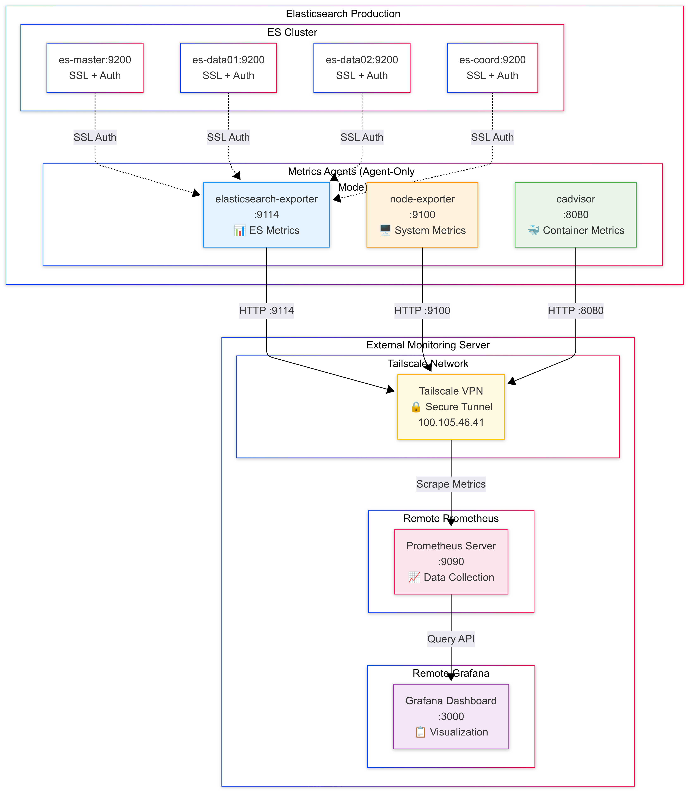
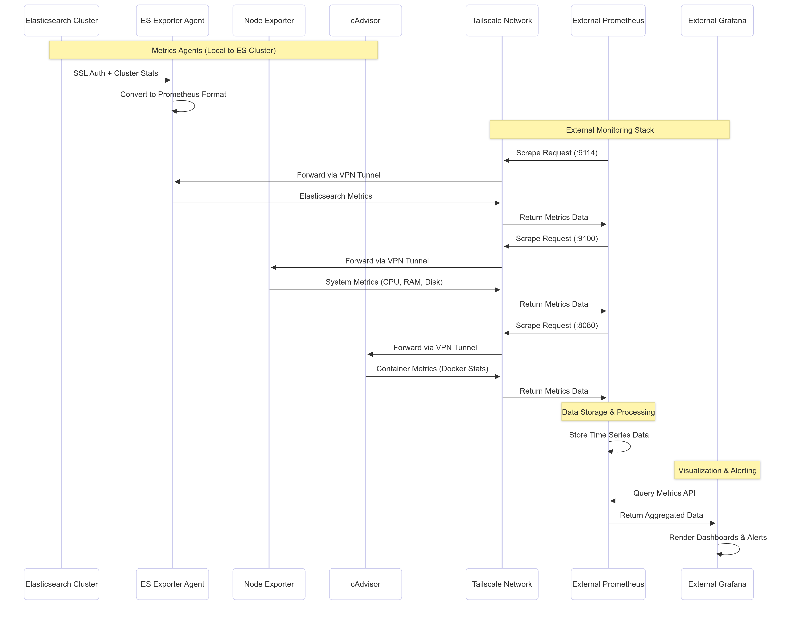
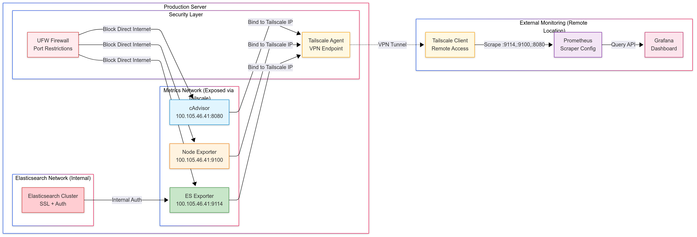
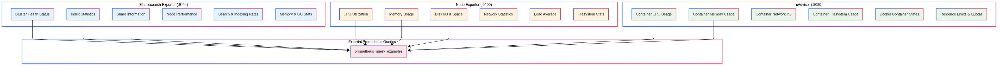
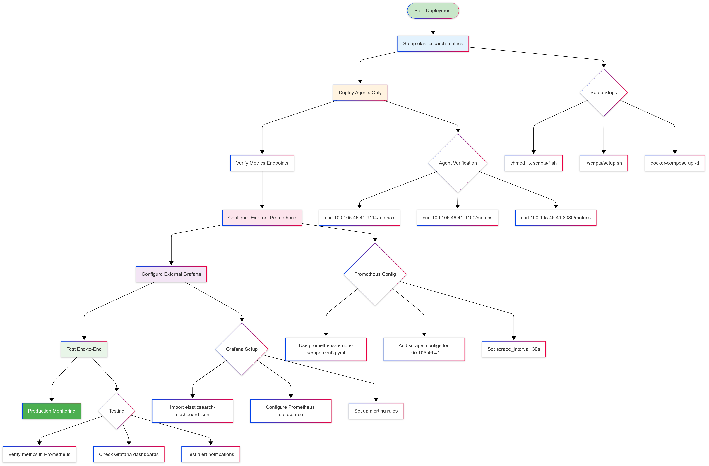

# 📊 Elasticsearch Metrics Agent (Updated for SSL + Remote Server)

Agent untuk monitoring Elasticsearch production cluster dengan SSL support untuk server Prometheus/Grafana eksternal.

## 🔧 MAJOR UPDATES

### SSL/HTTPS Support:
- ✅ **Updated for HTTPS Elasticsearch** (port 9200 SSL)
- ✅ **SSL certificate handling** (skip-verify for self-signed)
- ✅ **Authentication integration** (elastic user credentials)

### Remote Server Ready:
- ✅ **Agent-only mode** untuk server monitoring eksternal
- ✅ **External scraping endpoints** via Tailscale IP
- ✅ **Optimized for remote Prometheus/Grafana**

## Architecture

```
┌─────────────────────┐    ┌─────────────────────┐    ┌─────────────────────┐
│  Elasticsearch      │    │  Metrics Agents     │    │ Prometheus/Grafana  │
│  SSL Cluster        │    │  (Agent Mode)       │    │ (Remote Server)     │
│  HTTPS:9200         │◄───┤ - ES Exporter :9114 ├───►│ Scrapes via         │
│  (100.105.46.41)    │    │ - Node Expo. :9100  │    │ Tailscale Network   │
│  SSL Authentication │    │ - cAdvisor   :8080  │    │                     │
└─────────────────────┘    └─────────────────────┘    └─────────────────────┘
```

### **Complete Architecture Overview**


**High-Level Architecture Components:**
- **🏢 Elasticsearch Production Cluster**: SSL-enabled cluster dengan authentication
- **📊 Metrics Collection Agents**: Three specialized exporters untuk comprehensive monitoring
- **🔒 Tailscale VPN Network**: Secure tunnel untuk external access
- **📈 External Monitoring Stack**: Remote Prometheus dan Grafana servers
- **🛡️ Security Layers**: Multiple security controls (UFW, SSL, VPN)

This overview diagram shows the complete flow dari data collection hingga visualization, highlighting the security-focused agent-only approach yang minimizes resource overhead pada production Elasticsearch cluster.

## 📊 Detailed Architecture Diagrams

### **Data Flow & Scraping Pattern**


**Data Flow Process:**
1. **Local Metrics Collection**: Agents collect metrics dari Elasticsearch cluster (SSL authenticated)
2. **Format Conversion**: Convert ke Prometheus metrics format
3. **Tailscale Exposure**: Expose metrics via Tailscale IP (100.105.46.41)
4. **External Scraping**: Remote Prometheus scrapes melalui VPN tunnel
5. **Data Storage**: Prometheus stores time-series data
6. **Visualization**: External Grafana queries dan renders dashboards

### **Network & Security Architecture**


**Security Layers:**
- **🔒 SSL Authentication**: Agents authenticate ke SSL-enabled Elasticsearch
- **🛡️ UFW Firewall**: Block direct internet access, only Tailscale allowed
- **🔐 VPN Tunnel**: Tailscale provides secure tunnel untuk external access
- **📡 Selective Binding**: Metrics endpoints bound only to Tailscale IP

**Network Isolation Benefits:**
- ✅ **Zero Internet Exposure**: Metrics tidak accessible dari public internet
- ✅ **VPN-Only Access**: Hanya authenticated Tailscale clients yang dapat access
- ✅ **Internal Security**: Elasticsearch cluster tetap isolated di internal network
- ✅ **Scalable Access**: Multiple remote monitoring servers dapat connect via VPN

### **Metrics Collection Matrix**


**Comprehensive Metrics Coverage:**

#### **📊 Elasticsearch Exporter (:9114)**
- **Cluster Health**: Status, nodes, indices count
- **Index Statistics**: Document count, size, search/index rates
- **Shard Information**: Primary/replica distribution, unassigned shards
- **Node Performance**: CPU, memory, GC statistics per node
- **Search & Indexing**: Query latency, throughput, cache performance
- **JVM Metrics**: Heap usage, garbage collection frequency

#### **🖥️ Node Exporter (:9100)**
- **CPU Utilization**: Per-core usage, load averages, context switches
- **Memory Usage**: RAM utilization, swap usage, buffer/cache
- **Disk I/O**: Read/write operations, IOPS, queue depth
- **Network Statistics**: Bandwidth, packet rates, error rates
- **Filesystem**: Disk space usage, inode utilization
- **System Load**: 1/5/15 minute load averages

#### **🐳 cAdvisor (:8080)**
- **Container CPU**: Per-container CPU usage dan limits
- **Container Memory**: Memory usage, limits, OOM events
- **Container Network**: Network I/O per container
- **Container Filesystem**: Disk usage per container volume
- **Docker States**: Container status, restart counts
- **Resource Quotas**: CPU/memory limits vs actual usage

### **Deployment & Configuration Flow**


**Step-by-Step Deployment Process:**

#### **Phase 1: Local Setup**
```bash
# 1. Setup elasticsearch-metrics agents
cd /data/elasticsearch-metrics
chmod +x scripts/*.sh
./scripts/setup.sh

# 2. Deploy agents only (no local Prometheus/Grafana)
docker-compose up -d elasticsearch-exporter node-exporter cadvisor

# 3. Verify metrics endpoints
curl http://100.105.46.41:9114/metrics  # ES metrics
curl http://100.105.46.41:9100/metrics  # System metrics  
curl http://100.105.46.41:8080/metrics  # Container metrics
```

#### **Phase 2: External Prometheus Configuration**
```yaml
# Use prometheus-remote-scrape-config.yml
scrape_configs:
  - job_name: 'elasticsearch-cluster'
    static_configs:
      - targets: ['100.105.46.41:9114']
    metrics_path: /metrics
    scrape_interval: 30s
    relabel_configs:
      - target_label: cluster_name
        replacement: 'elastic-production'

  - job_name: 'system-metrics'  
    static_configs:
      - targets: ['100.105.46.41:9100']
    scrape_interval: 15s
    
  - job_name: 'container-metrics'
    static_configs:
      - targets: ['100.105.46.41:8080']
    scrape_interval: 30s
```

#### **Phase 3: External Grafana Setup**
```bash
# Import dashboard files:
# - elasticsearch-dashboard.json (main dashboard)
# - elasticsearch-dashboard-minimal.json (lightweight version)

# Configure Prometheus datasource:
# - Use grafana/datasource.json template
# - Update with your external Prometheus URL
```

#### **Phase 4: Validation & Testing**
```bash
# Test metrics in external Prometheus:
elasticsearch_cluster_health_status
rate(elasticsearch_indices_indexing_index_total[5m])

# Verify Grafana dashboards:
# - Cluster health panels
# - Performance metrics graphs  
# - Alert configurations
```

## 🎯 Agent-Only Mode Benefits

### **Why Agent-Only Architecture?**

#### **✅ Resource Efficiency**
- **Minimal Footprint**: Hanya agents yang running, no heavy Prometheus/Grafana
- **Low Overhead**: <200MB total memory untuk all agents
- **CPU Efficient**: <2% additional CPU load

#### **✅ Security & Isolation**
- **Network Isolation**: Monitoring traffic melalui Tailscale VPN only
- **Reduced Attack Surface**: No direct internet exposure
- **SSL Integration**: Native SSL authentication ke Elasticsearch cluster

#### **✅ Scalability & Flexibility**
- **External Monitoring**: Grafana/Prometheus dapat di berbagai locations
- **Multi-Tenant**: Multiple external monitoring servers dapat scrape
- **Independent Scaling**: Scale monitoring infrastructure independent dari ES cluster

#### **✅ Operational Benefits**
- **Centralized Monitoring**: Satu Prometheus/Grafana untuk multiple clusters
- **Cost Effective**: Shared monitoring infrastructure
- **Easy Backup**: Monitoring data backup di external server

### **Comparison: Agent vs Full Stack**

| Aspect | Agent-Only Mode | Full Stack Local |
|--------|-----------------|------------------|
| **Memory Usage** | ~200MB | ~2GB+ |
| **CPU Overhead** | <2% | 5-10% |
| **Network Exposure** | VPN-only | Multiple ports |
| **Maintenance** | Minimal | Complex |
| **Scaling** | External | Resource constrained |
| **Security** | VPN + Firewall | Multiple endpoints |
| **Backup Strategy** | External server | Local volumes |

## Quick Start

### 1. Setup Agent
```bash
cd /data/elasticsearch-metrics
chmod +x scripts/*.sh
./scripts/setup.sh
```

### 2. Verify Metrics
```bash
# Check all exporters
./scripts/monitor.sh

# Test individual endpoints
curl http://localhost:9114/metrics  # Elasticsearch metrics
curl http://localhost:9100/metrics  # System metrics  
curl http://localhost:8080/metrics  # Container metrics
```

## Prometheus Configuration

Tambahkan ke `prometheus.yml` di server Prometheus:

```yaml
scrape_configs:
  - job_name: 'elasticsearch-production'
    static_configs:
      - targets: ['100.105.46.41:9114']
    scrape_interval: 30s
    
  - job_name: 'elasticsearch-node'
    static_configs:
      - targets: ['100.105.46.41:9100']
    scrape_interval: 15s
    
  - job_name: 'elasticsearch-containers'
    static_configs:
      - targets: ['100.105.46.41:8080']
    scrape_interval: 15s
```

## Grafana Dashboard

Import dashboard dari file:
```
grafana/elasticsearch-dashboard.json
```

Atau buat dashboard dengan queries berikut:

### Key Metrics Queries

1. **Cluster Health**
   ```
   elasticsearch_cluster_health_status
   ```

2. **JVM Memory Usage**
   ```
   elasticsearch_jvm_memory_used_bytes / elasticsearch_jvm_memory_max_bytes * 100
   ```

3. **Index Rate**
   ```
   rate(elasticsearch_indices_indexing_index_total[5m])
   ```

4. **Search Rate**
   ```
   rate(elasticsearch_indices_search_query_total[5m])
   ```

5. **Disk Usage**
   ```
   elasticsearch_filesystem_data_used_bytes / elasticsearch_filesystem_data_size_bytes * 100
   ```

6. **CPU Usage**
   ```
   elasticsearch_process_cpu_percent
   ```

## Available Metrics

### Elasticsearch Exporter (Port 9114)
- Cluster health and status
- Node statistics
- Index metrics
- Shard information
- JVM memory and GC
- Thread pool stats
- Circuit breaker status

### Node Exporter (Port 9100) 
- CPU usage and load
- Memory utilization
- Disk I/O and space
- Network statistics
- File system metrics

### cAdvisor (Port 8080)
- Container CPU/Memory usage
- Docker container metrics
- Resource limits and usage
- Network and disk I/O per container

## Monitoring

### Health Checks
```bash
# Run complete health check
./scripts/monitor.sh

# Check specific service
docker-compose ps elasticsearch-exporter
docker-compose logs elasticsearch-exporter
```

### Troubleshooting

1. **Exporter not responding**
   ```bash
   docker-compose restart elasticsearch-exporter
   docker-compose logs elasticsearch-exporter
   ```

2. **Cannot connect to Elasticsearch**
   ```bash
   # Check Elasticsearch access
   curl -u elastic:password http://100.105.46.41:9200/_cluster/health
   
   # Check Tailscale connectivity
   ping 100.105.46.41
   ```

3. **Metrics not appearing in Prometheus**
   - Verify Tailscale IP access: `100.105.46.41`
   - Check firewall rules for ports 9114, 9100, 8080
   - Verify Prometheus scrape configuration

## Security

### Network Access - TAILSCALE ONLY
🔒 **PENTING**: Semua metrics endpoint hanya dapat diakses melalui IP Tailscale `100.105.46.41`

- ✅ Akses dari Tailscale subnet (100.64.0.0/10): **ALLOWED**
- ❌ Akses dari internet public: **BLOCKED**
- ❌ Akses dari LAN lokal: **BLOCKED**
- ✅ Localhost untuk health check: **ALLOWED**

### Konfigurasi Firewall
```bash
# Jalankan script firewall (otomatis saat setup)
./scripts/configure-firewall.sh

# Manual firewall rules
sudo ufw deny 9114 9100 8080  # Block semua akses
sudo ufw allow from 100.64.0.0/10 to any port 9114  # Elasticsearch Exporter
sudo ufw allow from 100.64.0.0/10 to any port 9100  # Node Exporter  
sudo ufw allow from 100.64.0.0/10 to any port 8080  # cAdvisor
```

### Endpoint Access
- **Elasticsearch Exporter**: `http://100.105.46.41:9114/metrics`
- **Node Exporter**: `http://100.105.46.41:9100/metrics`
- **cAdvisor**: `http://100.105.46.41:8080/metrics`

## 🔧 Production Best Practices & Troubleshooting

### **Common Issues & Solutions**

#### **1. Metrics Agent Connection Issues**

**Problem**: Elasticsearch Exporter cannot connect to SSL cluster
```bash
# Error symptoms:
docker-compose logs elasticsearch-exporter
# Shows: "dial tcp: connect: connection refused" or SSL errors
```

**Solutions:**
```bash
# Option A: Verify Elasticsearch cluster is accessible
curl -u elastic:K4a8ep8sMJMu4YxD -k "https://100.105.46.41:9200/_cluster/health"

# Option B: Check SSL certificate configuration
# Elasticsearch exporter needs to trust self-signed certificates
# Current config uses: --es.ssl-skip-verify=true

# Option C: Network connectivity check
docker exec elasticsearch-exporter ping es-master
docker network ls | grep elasticsearch
```

#### **2. Tailscale IP Binding Issues**

**Problem**: Metrics accessible on localhost but not via Tailscale IP
```bash
# Test local access (works)
curl http://localhost:9114/metrics

# Test Tailscale access (fails)  
curl http://100.105.46.41:9114/metrics
```

**Solution**: Verify port binding in docker-compose.yml
```yaml
# Correct configuration:
ports:
  - "100.105.46.41:9114:9114"  # Bind to Tailscale IP specifically
  
# Incorrect (binds to all interfaces):
ports:
  - "9114:9114"  # This allows public access
```

#### **3. High Memory Usage from Agents**

**Problem**: Monitoring agents consuming excessive memory
```bash
# Check memory usage
docker stats elasticsearch-exporter node-exporter cadvisor
```

**Solutions:**
```yaml
# Add memory limits in docker-compose.yml
services:
  elasticsearch-exporter:
    mem_limit: 128m
    mem_reservation: 64m
    
  node-exporter:
    mem_limit: 64m
    mem_reservation: 32m
    
  cadvisor:
    mem_limit: 256m
    mem_reservation: 128m
```

#### **4. External Prometheus Cannot Scrape**

**Problem**: External Prometheus shows targets as "DOWN"
```bash
# Check from external server
telnet 100.105.46.41 9114
# Connection refused or timeout
```

**Diagnosis & Solutions:**
```bash
# 1. Verify Tailscale connectivity
ping 100.105.46.41  # From external Prometheus server

# 2. Check firewall rules
sudo ufw status | grep -E "9114|9100|8080"

# 3. Test direct curl from external server
curl -v http://100.105.46.41:9114/metrics

# 4. Verify agent containers are running
docker-compose ps
```

#### **5. Missing or Incomplete Metrics**

**Problem**: Some Elasticsearch metrics tidak muncul di Prometheus

**Solutions:**
```bash
# Check ES exporter parameters
docker-compose logs elasticsearch-exporter | grep -i error

# Verify ES permissions dan authentication
curl -u elastic:K4a8ep8sMJMu4YxD "http://100.105.46.41:9200/_cluster/stats"

# Test metrics endpoint directly
curl http://100.105.46.41:9114/metrics | grep elasticsearch_cluster_health
```

### **Performance Optimization**

#### **Scrape Interval Optimization**
```yaml
# Recommended intervals by metric type:
scrape_configs:
  - job_name: 'elasticsearch-cluster'
    scrape_interval: 30s    # ES metrics change slowly
    scrape_timeout: 15s
    
  - job_name: 'system-metrics'
    scrape_interval: 15s    # System metrics need frequent monitoring
    scrape_timeout: 10s
    
  - job_name: 'container-metrics'
    scrape_interval: 30s    # Container metrics moderate frequency
    scrape_timeout: 15s
```

#### **Resource Allocation Guidelines**
```bash
# Production resource recommendations:
# - Elasticsearch Exporter: 128MB RAM, 0.1 CPU core
# - Node Exporter: 64MB RAM, 0.05 CPU core  
# - cAdvisor: 256MB RAM, 0.1 CPU core

# Total overhead: ~448MB RAM, ~0.25 CPU core
```

#### **Network Bandwidth Optimization**
```bash
# Estimated metrics traffic:
# - Elasticsearch metrics: ~50KB per scrape
# - System metrics: ~30KB per scrape
# - Container metrics: ~40KB per scrape

# Total: ~120KB per scrape interval
# At 30s interval: ~240KB/minute atau ~345MB/day
```

### **Security Hardening**

#### **Firewall Configuration Verification**
```bash
# Verify UFW rules are applied correctly
sudo ufw status verbose

# Expected rules:
# 9114 DENY IN Anywhere
# 9114 ALLOW IN 100.64.0.0/10  
# 9100 DENY IN Anywhere
# 9100 ALLOW IN 100.64.0.0/10
# 8080 DENY IN Anywhere  
# 8080 ALLOW IN 100.64.0.0/10
```

#### **Tailscale Security Audit**
```bash
# Check Tailscale status
tailscale status

# Verify IP assignment
ip addr show tailscale0

# Check route table
tailscale netcheck
```

#### **SSL Configuration Validation**
```bash
# Verify SSL connection to Elasticsearch
openssl s_client -connect 100.105.46.41:9200 -servername es-master

# Check certificate chain if needed
curl -v -u elastic:K4a8ep8sMJMu4YxD "https://100.105.46.41:9200/_cluster/health"
```

### **Monitoring the Monitoring**

#### **Agent Health Checks**
```bash
# Automated health check script
./scripts/monitor.sh

# Manual health verification
curl http://100.105.46.41:9114/  # Should return 404 but connection success
curl http://100.105.46.41:9100/  # Should return basic page
curl http://100.105.46.41:8080/  # Should return cAdvisor UI
```

#### **Metrics Quality Validation**
```bash
# Verify key metrics are present
curl http://100.105.46.41:9114/metrics | grep -c elasticsearch_cluster_health
# Should return > 0

curl http://100.105.46.41:9100/metrics | grep -c node_cpu_seconds_total
# Should return > 0

curl http://100.105.46.41:8080/metrics | grep -c container_cpu_usage_seconds_total  
# Should return > 0
```

### **Alerting Integration**

#### **Critical Alerts Configuration**
```yaml
# Prometheus alerting rules untuk agents
groups:
  - name: elasticsearch-monitoring
    rules:
      - alert: ElasticsearchExporterDown
        expr: up{job="elasticsearch-cluster"} == 0
        for: 2m
        annotations:
          summary: "Elasticsearch exporter is down"
          description: "Cannot scrape Elasticsearch metrics from {{ $labels.instance }}"
          
      - alert: NodeExporterDown  
        expr: up{job="system-metrics"} == 0
        for: 2m
        annotations:
          summary: "Node exporter is down"
          description: "Cannot scrape system metrics from {{ $labels.instance }}"

      - alert: HighMetricsScrapeDuration
        expr: scrape_duration_seconds > 10
        for: 5m  
        annotations:
          summary: "High scrape duration detected"
          description: "Scraping metrics taking > 10 seconds on {{ $labels.instance }}"
```

#### **Grafana Dashboard Health Panels**
```bash
# Import enhanced dashboard dengan agent monitoring:
# - Agent uptime panels
# - Scrape duration metrics
# - Network connectivity status
# - Resource usage by monitoring stack
```

### **Backup & Recovery**

#### **Configuration Backup**
```bash
# Backup critical configurations
tar -czf elasticsearch-metrics-backup-$(date +%Y%m%d).tar.gz \
    docker-compose.yml \
    prometheus-remote-scrape-config.yml \
    grafana/ \
    scripts/

# Store backup secara secure (encrypt if needed)
gpg -c elasticsearch-metrics-backup-$(date +%Y%m%d).tar.gz
```

#### **Disaster Recovery Steps**
```bash
# 1. Verify Elasticsearch cluster health
curl -u elastic:K4a8ep8sMJMu4YxD "http://100.105.46.41:9200/_cluster/health"

# 2. Redeploy agents
docker-compose down
docker-compose up -d

# 3. Verify connectivity
./scripts/monitor.sh

# 4. Update external Prometheus if config changed
# Copy prometheus-remote-scrape-config.yml to external server
```

## Maintenance

### Start/Stop Services
```bash
# Start all exporters
docker-compose up -d

# Stop all exporters
docker-compose down

# Restart specific service
docker-compose restart elasticsearch-exporter
```

### Log Management
```bash
# View logs
docker-compose logs -f elasticsearch-exporter
docker-compose logs -f node-exporter
docker-compose logs -f cadvisor

# Rotate logs (add to crontab)
docker system prune -f --filter "until=168h"
```

## Integration Examples

### Alerting Rules (Prometheus)
```yaml
groups:
  - name: elasticsearch
    rules:
      - alert: ElasticsearchClusterRed
        expr: elasticsearch_cluster_health_status == 0
        for: 5m
        annotations:
          summary: "Elasticsearch cluster status is RED"
          
      - alert: ElasticsearchHighMemoryUsage
        expr: elasticsearch_jvm_memory_used_bytes / elasticsearch_jvm_memory_max_bytes > 0.9
        for: 5m
        annotations:
          summary: "Elasticsearch JVM memory usage > 90%"
```

### Grafana Alerts
- Cluster health status changes
- High JVM memory usage (>85%)
- Low disk space (<10%)
- High CPU usage (>80%)
- Index/Search rate anomalies

## Performance Impact

Monitoring overhead:
- **CPU**: <2% additional load
- **Memory**: ~100MB for all exporters
- **Network**: <1MB/min metrics traffic
- **Disk**: Minimal (logs only)

## 📋 Agent-Only Monitoring Summary

### **🎯 What This Setup Provides**

#### **✅ Complete Metrics Coverage**
- **📊 Elasticsearch Cluster Metrics**: Health, performance, indices, shards
- **🖥️ System Resource Metrics**: CPU, memory, disk, network utilization  
- **🐳 Container Runtime Metrics**: Docker resource usage dan performance
- **🔒 SSL-Authenticated Collection**: Secure connection ke production ES cluster

#### **✅ Production-Ready Security**
- **VPN-Only Access**: Metrics hanya accessible via Tailscale network
- **Firewall Protection**: UFW rules block direct internet access
- **SSL Integration**: Native SSL support untuk ES cluster communication
- **Minimal Attack Surface**: No external monitoring stack exposure

#### **✅ External Integration Ready**
- **Remote Prometheus**: Pre-configured scrape configs untuk external setup
- **Grafana Dashboards**: Ready-to-import dashboard configurations
- **Scalable Architecture**: Multiple external monitoring servers dapat connect
- **Low Overhead**: <200MB RAM, <2% CPU impact pada ES cluster

### **🚀 Key Advantages Over Full Stack**

| Feature | Agent-Only Mode | Full Local Stack |
|---------|-----------------|------------------|
| **Resource Usage** | ~200MB RAM | ~2GB+ RAM |
| **Security Exposure** | VPN-only | Multiple ports |
| **Maintenance Effort** | Minimal | Complex |
| **Scaling Flexibility** | External scaling | Resource constrained |
| **Cost Efficiency** | Shared monitoring | Dedicated resources |
| **Backup Strategy** | External server | Local volumes |
| **Multi-Tenant** | ✅ Supported | ❌ Limited |

### **📊 Architecture Diagrams Summary**

1. **[Complete Architecture Overview](images/ES-agent_Overview_Architecture.png)**: High-level view of entire monitoring architecture dari ES cluster to external visualization
2. **[Data Flow & Scraping Pattern](images/ES-agent_DataFlow_&_Scraping_Pattern.png)**: Detailed flow showing how metrics travel from ES cluster → Agents → External Prometheus → Grafana
3. **[Network & Security Architecture](images/ES-agent_Network_&_Security_Architecture.png)**: Comprehensive security model dengan VPN, firewall rules, dan network isolation
4. **[Metrics Collection Matrix](images/ES-agent_Metrics_Collection_Matrix.png)**: Complete breakdown of all available metrics dari each monitoring agent
5. **[Deployment & Configuration Flow](images/ES-Agent_Deployment_&_ConfigurationFlow.png)**: Step-by-step deployment process dari initial setup to production monitoring

### **🔧 Ready for Production**

**This setup provides enterprise-grade monitoring dengan:**
- ✅ **Zero-downtime deployment** - Agents dapat di-deploy tanpa mengganggu ES cluster
- ✅ **Comprehensive observability** - Full visibility into cluster health dan performance  
- ✅ **Secure remote access** - VPN-protected metrics collection
- ✅ **Scalable architecture** - Easy integration dengan existing monitoring infrastructure
- ✅ **Cost-effective solution** - Minimal resource overhead pada production cluster

**Perfect for:**
- Production Elasticsearch clusters yang membutuhkan external monitoring
- Organizations dengan centralized Prometheus/Grafana infrastructure
- Security-conscious environments yang memerlukan VPN-only access
- Cost-optimized deployments dengan shared monitoring resources

## Support

Untuk troubleshooting:
1. Check agent status: `./scripts/monitor.sh`
2. Verify network connectivity to Tailscale IP
3. Ensure Elasticsearch cluster is healthy
4. Check Prometheus/Grafana server configuration